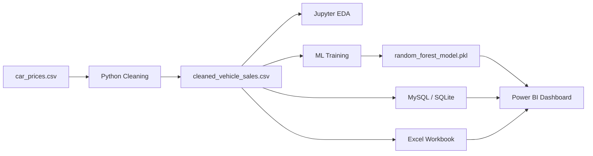

# Project Architecture

## Layers

| Layer | Location | Purpose |
|-------|----------|---------|
| Raw | `dataset/raw/` | Source CSV |
| Cleaned | `dataset/cleaned/` | Production-ready table |
| SQL | `sql/01–07` | Cleaning, EDA, business, windows, views, insights |
| Python | `python/scripts/`, `python/notebooks/` | Pipeline, ML, charts |
| Excel | `excel/vehicle_sales_analysis.xlsx` | Pivot matrices & summaries |
| ML | `python/models/` | Serialized models + metrics |
| BI | `powerbi/` | Dashboard + CSV import |
| Visuals | `visuals/` | Static charts for reports |

## Run Order

1. `python python/scripts/cleaning.py`
2. Execute SQL scripts in order (`01` → `07`) on MySQL, or `python python/scripts/setup_sqlite.py` for local SQLite
3. `python python/scripts/build_excel_analysis.py`
4. `python python/scripts/train_model.py`
5. `python python/scripts/generate_eda_charts.py`
6. Import `powerbi/vehicle_sales_for_powerbi.csv` into Power BI Desktop
